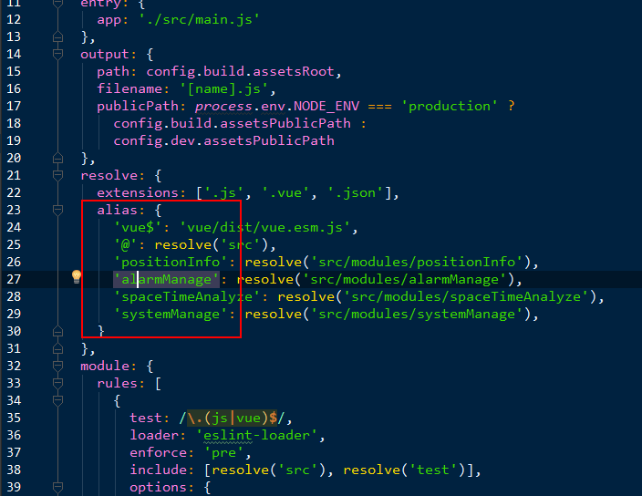

# vue开发规范
## 命名
  * 文件夹命名
    * 由名词组成（car、order、car...）
    * 尽量以一个单词命名（推荐: car order cart）（不推荐: carInfo carpage）
    * 以小写开头（good: car）（bad: Car）
  * 组件命名（*.vue）
    * 命名要表名组件的用途。
    * 多个单词以“-”分割
    例：todo-list.vue
  * 函数命名
    * 公有函数使用小驼峰式命名，如getName() {}
    * 如果是私有的则在函数名前加“_”,如 _getName(){}
# 使用
  * 组件中配置项的顺序
     * props
     * data
     * computed
     * watch
     * created
     * mounted
     * activited
     * update
     * filter
     * metods
     * components
  * 组件的引用,引入的组件命名使用首字母大写的形式，因为组件是一个类
    ```javascript
      // 推荐
      import TempComponent from 'temp-component'

      // 不推荐
      import tempComponent from 'temp-component'
    ```
  * 组件在html片段中使用的时候，使用小写字母，且每个单词以“-”分割
    ```html
      <!-- 推荐 -->
      <div>
        <temp-component></temp-component>
      </div>

      <!-- 不推荐 -->
      <div>
        <TempComponent></TempComponent>
      </div>
    ```
  * props传值。props定义的时候，如果使用的小驼峰命名，则父组件传值的时候使用“-”进行分割
    例如：
    ```
    // 定义
    props: {
      dataName: {
        type: String
      }
    }

    // 使用
    <components data-name="123"></components>
    ```
  * 加强对vue的理解，避免错误的使用

      尽量不要在代码中使用原生js或者jquery操作dom
      例如：直接使用document.getElementById('id')或者$('#id')等方式获取dom进行操作。可以使用vue中提供ref获取dom节点，进行操作，具体使用方式参考vue官网api
  * 将常量定义在外部，不要定义在data中
      例如：const API_URL = 'xxxx',直接使用即可
      而不是在data中定义。
      ```javascript
        data() {
          return {
            url: 'xxx'
          }
        }
      ```
      这样会使代码看起来复杂。
  * data中只是定义一下需要实时响应的数据，不需要根据数据变化，刷新视图的，则不要定    义在data中，直接通过 this.d = XXX即可。
    如下：这里url不是根据url的变化去刷新视图，所以没有必要定义在data中，可以直接使用this.url = 'xxx'
    ```javascript
      data() {
        return {
          url: 'xxx'
        }
      }
    ```
  * 如果引用的组件需要嵌套很深的话，在build文件夹中的webpack.base.conf.js配置一下。
  